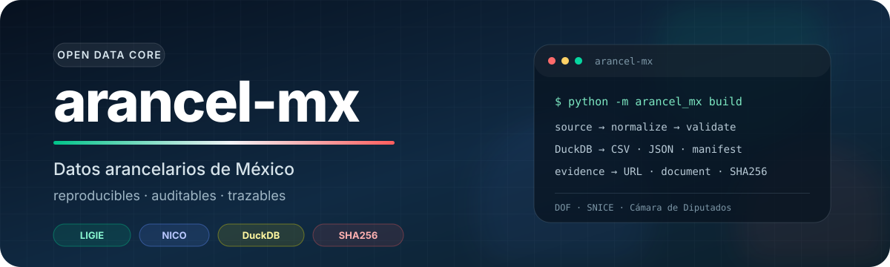
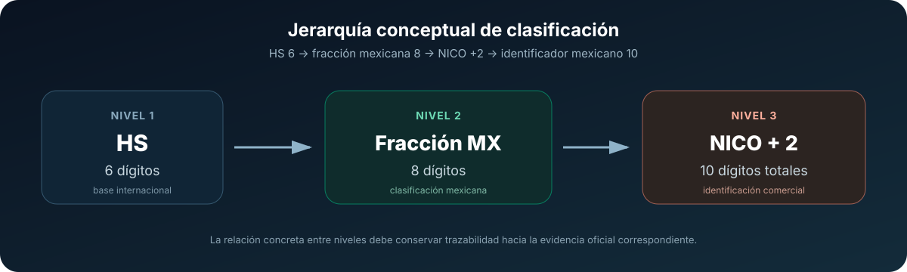
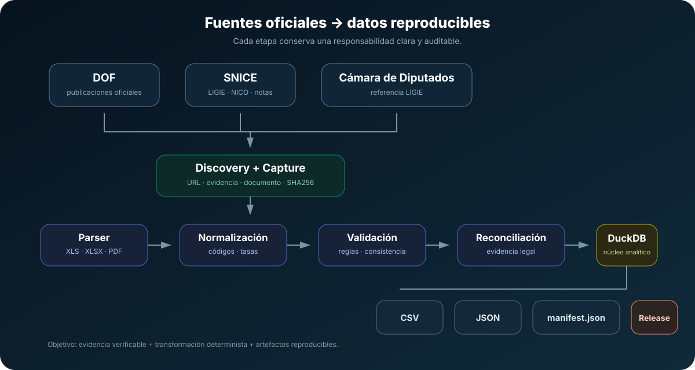
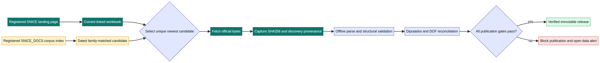
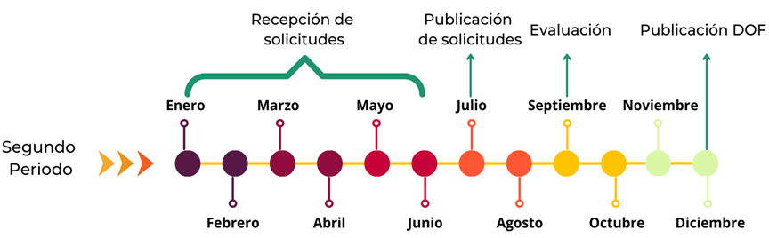
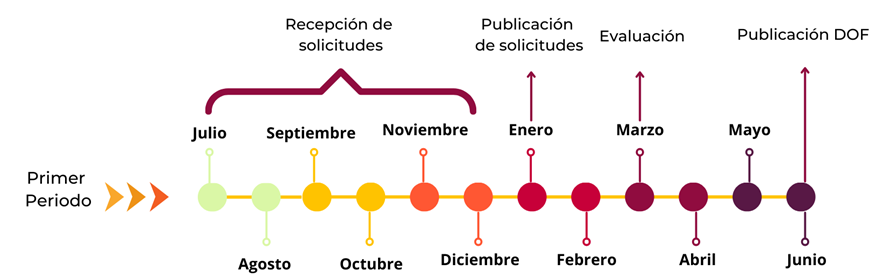
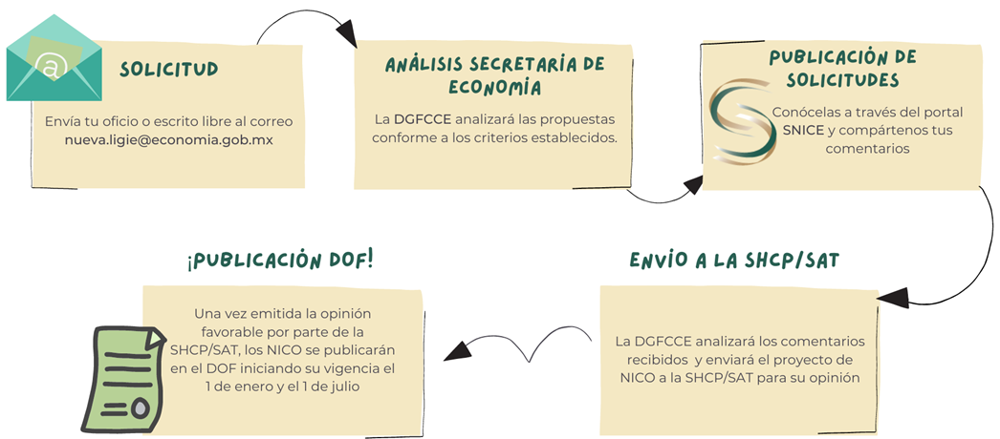

<div align="center">



# arancel-mx

### Reproducible, auditable, traceable Mexican tariff data

Open Python tools to capture, normalize, reconcile, and publish Mexican tariff data with verifiable provenance.

<p>
  <a href="./README.md">Español</a> · <strong>English</strong>
</p>

[](https://github.com/jccontrerasg08-cpu/arancel-mx/actions)
[](https://www.python.org)
[](LICENSE)
[](https://duckdb.org/)
[](CONTRIBUTING.md)

**[Installation](#installation)** · **[CLI](#quick-cli-usage)** · **[Python](#python-usage)** · **[Downstream ingest](#downstream-ingest)** · **[Data](#data-model)** · **[Sources](#official-sources)** · **[Automation](#official-data-pipeline)** · **[Documentation](docs/README.md)** · **[Certification](docs/production-certification.md)** · **[Contributing](#contributing)**

</div>

<div align="center">

## Latest dataset release

**Always download the most recent public `arancel-mx` dataset release.**

**[DuckDB](https://github.com/jccontrerasg08-cpu/arancel-mx/releases/latest/download/arancel_mx.duckdb)** ·
**[CSV](https://github.com/jccontrerasg08-cpu/arancel-mx/releases/latest/download/arancel_mx.csv)** ·
**[JSON](https://github.com/jccontrerasg08-cpu/arancel-mx/releases/latest/download/arancel_mx.json)** ·
[Manifest](https://github.com/jccontrerasg08-cpu/arancel-mx/releases/latest/download/manifest.json) ·
[SHA256SUMS](https://github.com/jccontrerasg08-cpu/arancel-mx/releases/latest/download/SHA256SUMS) ·
[Official sources](https://github.com/jccontrerasg08-cpu/arancel-mx/releases/latest/download/official-sources.tar.gz) ·
**[View release](https://github.com/jccontrerasg08-cpu/arancel-mx/releases/latest)**

<sub>The `/releases/latest/download/...` links automatically resolve to assets from the public release currently marked as latest. GitHub lists the size of each asset on that page; identity is `SHA256SUMS`, not the megabyte.</sub>

</div>

```bash
sha256sum -c SHA256SUMS
```

---

<p align="center">
  
</p>

<p align="center"><strong>Capture · Reconcile · Normalize · Validate · Publish</strong></p>

---

## Scope

`arancel-mx` is a public project focused on an open, reproducible, auditable data layer for LIGIE, NICO, and their official Mexican sources. The public core prioritizes data, documentary provenance, validation, DuckDB, and reproducible artifacts rather than trying to replace a complete commercial foreign-trade platform.

> [!IMPORTANT]
> `arancel-mx` is a technical data tool. **It does not constitute legal advice.** For tariff-classification, regulatory-compliance, import, or export decisions, consult the applicable official publications and qualified professionals when appropriate.

## Quick summary

- Captures registered Diputados, DOF, and SNICE snapshots with SHA256 and real `retrieved_at` timestamps.
- Can evidence-gate a uniquely newer, dated LIGIE or NICO candidate from the registered SNICE_DOCS corpus before the landing page updates; parsing and legal reconciliation still block publication on any failure.
- Reconciles legal evidence before a candidate can be publishable.
- Normalizes HS2, HS4, HS6, Mexican 8-digit tariff fractions, and 10-digit NICO identifiers.
- Materializes DuckDB and exports CSV, JSON, and a schema v2 manifest.
- Detects `no_change` without creating redundant releases.
- Runs a **daily automated check** and performs **automatic publication** only for a changed dataset that passes every gate.
- Creates or updates a **GitHub Issue** when a production stage fails.
- Publishes verified immutable releases named `data-YYYY.MM.DD` with an exact six-asset contract.
- Maintains an isolated manual certification workflow for release/Issue permissions and rollback without touching `data-*` releases.

## What makes it different

| Property | Implementation |
|---|---|
| Provenance | Each source keeps authority, URL, identity, hash, and capture time |
| Legal evidence | The registered Diputados ledger is reconciled against DOF and registered sources |
| Fail-closed | Discrepancies, parser ambiguity, checksum errors, or invalid data block publication |
| Reproducibility | Exact production constraints and manifest schema v2 |
| Determinism | Canonical exports, checksums, and a captured-source archive |
| Auditability | Releases identify the registry, commit, GitHub run, and exact Actions artifact |
| Recovery | Deterministic automation alerts close only after a later healthy production run |

## HS to Mexican tariff fraction and NICO

```text
HS 2
  ↓
HS 4
  ↓
HS 6
  ↓
Mexican tariff fraction, 8 digits
  ↓
NICO, 10 digits
```

<p align="center">
  
</p>

The canonical model validates parent-child relationships so a tariff fraction cannot be published without its HS6 parent and a NICO cannot be published without its active tariff fraction.

## Architecture

```text
official sources → capture → legal reconciliation → parse → validate
→ unchanged: stop green
→ changed + valid: verified immutable release
→ any failure: block publication + GitHub Issue
```

In component terms:

```text
Diputados / DOF / SNICE
          ↓
 source_registry + discovery
          ↓
 capture + source_capture.json
          ↓
 SHA256 + retrieved_at
          ↓
 legal reconciliation
          ↓
 offline XLS/XLSX/PDF parsers
          ↓
 normalization + validation
          ↓
 canonical DuckDB
    ↙       ↓       ↘
  CSV      JSON    manifest.json
          ↓
 verified six-asset bundle
          ↓
 GitHub Release data-YYYY.MM.DD
```

<p align="center">
  
</p>

### Fast source promotion without weaker trust

The LIGIE and NICO registries can also inspect the explicit public SNICE_DOCS corpus. A corpus document is eligible only when it is on the registered index, matches an allowed family and media type, contains a valid date, and is the unambiguous newest candidate. Its discovery origin is retained with the captured SHA256; parsing, validation, Diputados/DOF reconciliation, and release certification remain unchanged publication gates.

<p align="center">
  
</p>

Read the [source-promotion policy](docs/source-promotion.md) for the exact allowlist, NICO limits, and rollback procedure.

## Installation

Python 3.11 or newer is required.

### Published dataset consumer

`arancel-mx==0.2.0` is published on PyPI (uploaded 2026-08-12 via Trusted Publishing). The 2026-08-11 design's full external OS/Python matrix was not a blocking gate for that upload. `0.3.3` blocks PyPI on Ubuntu/Windows/macOS × CPython 3.11–3.13 after TestPyPI.

```bash
pip install arancel-mx==0.2.0
arancel-mx --version
arancel-mx doctor
```

The package and datasets are versioned independently. Pinning the package does not pin the dataset. `arancel-mx --version` reports the Python package version; each dataset uses an immutable `data-YYYY.MM.DD` release.

### Repository development

For contributors and publication-pipeline work from a checkout:

```bash
python -m venv .venv
# PowerShell: .\.venv\Scripts\Activate.ps1
# macOS/Linux: source .venv/bin/activate
python -m pip install -e ".[dev]"
python -m arancel_mx --help
```

Official builds and CI use the reproducible environment constrained by `requirements/production-build.txt`:

```bash
python -m pip install pip==26.2.1
python -m pip install -c requirements/production-build.txt -e ".[dev]"
```

## Downstream ingest

Downstream apps should pin, install, verify, and query `arancel-mx` as an upstream data package. The Spanish source of truth is [`docs/external-consumption.md`](docs/external-consumption.md). Spanish-first discovery guides cover the [consumer quickstart](docs/consumer-quickstart.md), [official source roles](docs/official-source-roles.md), and [NICO/LIGIE hierarchy](docs/nico-ligie-guide.md). Short path:

1. **Install** and pin: `pip install arancel-mx==0.2.0`, then select `--dataset data-YYYY.MM.DD`.
2. **Verify** with `arancel-mx doctor`, `data download`, `data verify`, `SHA256SUMS`, and manifest schema v2.
3. **Query** IGI/IGE via CLI or `Dataset` (`lookup`, `ficha`, `compare`, `provenance`). Display official `igi_text` / `ige_text` literals; do not rewrite them to percentages. `compare` against VUCEM is informative, not legal identity.
4. **Additional public surface:** the in-tree `0.3.3` contract includes the public HTTP API described below. IVA, NOM, T-MEC, and hosted Postgres remain outside this repository's published data model.

Do not treat a self-ingested copy as upstream truth.

### Public HTTP API

The public HTTP API is **GET-only**, **read-only**, and requires **no API key**. Its stable contract is versioned under `/v1`; `/docs` exposes interactive OpenAPI documentation, `/readyz` reports readiness only after the pinned dataset is verified, and `/v1/meta` reports API, package, and dataset identities separately.

Production startup must pin an immutable data release, for example:

```text
ARANCEL_MX_API_DATASET=data-2026.08.15
```

There is no implicit `latest` fallback. The HTTP layer uses the existing verified `Dataset` facade, **does not classify merchandise**, and is not legal advice. It exposes no source-update, reconciliation, publication, live VUCEM-compare, or WCO-download endpoint.

Until a production hostname is verified, documentation deliberately uses a placeholder rather than inventing one:

```bash
export ARANCEL_MX_API_URL="https://<deployment-host>"
curl "$ARANCEL_MX_API_URL/v1/lookup/8517130100"
```

The detailed contract and endpoint list live in [`docs/external-consumption.md`](docs/external-consumption.md).

## Quick CLI usage

The consumer flow starts from published data and does not require cloning the repository:

```bash
arancel-mx doctor
arancel-mx data download
arancel-mx lookup 01012101
arancel-mx ficha 01012101
arancel-mx compare 01012101
arancel-mx chapters
arancel-mx search "refrigeradores"
arancel-mx suggest "camisas de algodón de punto"
arancel-mx wco cite 01
arancel-mx data verify
```

After a release has been downloaded and verified, queries can run in strict offline mode:

```bash
arancel-mx lookup 01012101 --offline --format json
arancel-mx data verify --offline --format json
```

Pin an exact release with `--dataset data-YYYY.MM.DD`. See [`docs/consumer-cli.md`](docs/consumer-cli.md) for `data status/list/update/path/verify`, JSON/CSV formats, environment variables, cache integrity, and the `doctor` contract.

### Consumer commands

| Command | Purpose |
|---|---|
| `doctor` | Diagnose installation, cache, dataset, DuckDB, and remote access |
| `data download` | Download and promote only a verified release into the cache |
| `data status` / `data list` | Show local versions and, when requested, valid remote releases |
| `data update` | Download the newest valid release without deleting older versions |
| `data path` | Print only the selected DuckDB path |
| `data verify` | Revalidate local integrity and optionally the remote bundle |
| `lookup` / `search` | Query by exact code or text |
| `suggest` | Retrieve ficha and national notes for top candidates; does not classify |
| `wco cite` / `wco download` | WCO HS 2022 PDF URL (and cache path if present); reading support, not LIGIE/NICO authority |
| `ficha` | Hierarchy card from chapter → fraction/NICO with UM, IGI, and IGE |
| `compare` | Diff GitHub-dataset HS6 / MX8 / NICO against VUCEM (informative) |
| `chapters` | List current HS2 chapters |
| `parent` / `children` | Navigate HS2 → HS4 → HS6 → MX8 → NICO10 |
| `provenance` | Show documentary traceability for a selected code |

### Repository maintainer commands

Maintainers retain the build and publication commands:

```bash
# export artifacts from an already validated DuckDB database
python -m arancel_mx build --database data/arancel.duckdb --output-dir out/release

# check registered official-source state and write a change report
python -m arancel_mx check-updates --state-path data/update_state/ligie.json --report-path out/update.json

# reconcile legal evidence
python -m arancel_mx reconcile --ledger-json ledger.json --dof-json dof.json --snice-json snice.json

# verify and prepare a local publication bundle
python -m arancel_mx release --release-dir out/release --source-dir data/raw/release --latest-dir out/latest
```

## Python usage

```python
from arancel_mx import Dataset

dataset = Dataset.latest()
card = dataset.ficha("01012101")
print(card.formatted_code, card.record.description, card.record.igi_text)
for chapter in dataset.chapters():
    print(chapter.code, chapter.description)
```

`Dataset.open("arancel_mx.duckdb")` opens a local file after structural validation. `ficha` and `chapters` read the verified official dataset; they do not scrape SIICEX-CAAAREM or dumps such as tigies-mx.

## Data model

DuckDB separates classification, tariff rates, legal intervals, and provenance. Main tables include `source_registry`, `source_document`, `hs_code`, `tariff_fraction`, `nico`, `tariff_rate`, `canonical_record`, `record_provenance`, and `dataset_release`.

The release manifest uses schema v2 and records fields such as `registry_sha256`, `git_commit_sha`, `github_run_id`, `github_run_attempt`, `github_workflow_ref`, and `github_artifact_name`.

See [`docs/data-model.md`](docs/data-model.md) for the semantics of `retrieved_at`, `generated_at`, and `dataset_release.release_metadata_json`.

## Artifacts and reproducibility

A valid public release contains exactly:

```text
release/
├── arancel_mx.duckdb
├── arancel_mx.csv
├── arancel_mx.json
├── manifest.json
├── SHA256SUMS
└── official-sources.tar.gz
```

`manifest.json` records version, provenance, reconciliation, counts, and hashes. `SHA256SUMS` covers the other five assets. `official-sources.tar.gz` preserves the captured official bytes and their `source_capture.json`.

Logical data is reproducible. A physical DuckDB file is verified by SHA256 for that specific build without assuming that two independently created DuckDB files must be byte-for-byte identical.

## End-to-end official dataset build

The public builder remains available:

```bash
python scripts/build_official_dataset.py \
  --work-dir data/embedded/official-build \
  --output-dir out/release \
  --effective-as-of 2026-08-10 \
  --dataset-version 2026.08.10
```

For production, `scripts/run_official_pipeline.py` adds comparison against the previous published manifest, structured diagnostics, and `no_change` semantics.

## Official data pipeline

The **Official data pipeline** workflow is defined in [`.github/workflows/official-data-pipeline.yml`](.github/workflows/official-data-pipeline.yml).

- Schedule: `17 11 * * *`, a **daily automated check** in UTC.
- `workflow_dispatch`: available for trusted manual dry-runs; `publish=false` is the default manual value.
- Build: global/read-only `contents: read` with offline tests before source access.
- Publish: `contents: write` only when trusted `main` produced `built` and mutation is authorized.
- Notify: `issues: write` only for the automation-alert lifecycle.
- Canary: [`.github/workflows/published-bundle-canary.yml`](.github/workflows/published-bundle-canary.yml) (`47 12 * * *`) verifies the public six-asset contract; `contents: read`, no `[hs]`/`[dev]` extras.

**Automatic publication** occurs only for a valid, changed, independently verified candidate. **Any failure blocks publication.** If the registered source identity is unchanged, `no_change` stops green and the publisher remains `skipped`.

Before publication, the bundle is verified locally, verified again after downloading the exact Actions artifact, uploaded to a draft release, and remotely verified before the draft becomes public. An existing `data-YYYY.MM.DD` tag or release is never overwritten.

See [`docs/release-process.md`](docs/release-process.md) for the exact transaction and failure model and [`docs/production-certification.md`](docs/production-certification.md) for the isolated write-boundary certification runbook.

## Official sources

The versioned registry lives at `src/arancel_mx/sources/source_registry.json`.

Primary registered URLs include:

- [Chamber of Deputies, LIGIE](https://www.diputados.gob.mx/LeyesBiblio/ref/ligie_2022.htm)
- [SNICE, LIGIE](https://www.snice.gob.mx/cs/avi/snice/ligie.info22.html)
- [SNICE, NICO and NICO proposals](https://www.snice.gob.mx/cs/avi/snice/ligie.nico2022.html)
- [SNICE, National Notes](https://www.snice.gob.mx/cs/avi/snice/ligie.notasnac22.html)
- [SNICE, indicators](https://www.snice.gob.mx/cs/avi/snice/ligie.indicaranc22.html)
- [Diario Oficial de la Federación, related publication](https://dof.gob.mx/nota_detalle.php?codigo=5656249&fecha=27/06/2022)

[`docs/sources.md`](docs/sources.md) explains how the registered Diputados ledger anchors reconciliation and how DOF evidence acts as a blocking publication gate. The [SNICE_DOCS promotion policy](docs/source-promotion.md) documents the evidence-gated aggressive discovery path and rollback. SIICEX-CAAAREM and dumps such as tigies-mx are not official sources.

## Official process visuals

### DOF schedule, part 1

<p align="center">
  
</p>

### DOF schedule, part 2

<p align="center">
  
</p>

### NICO / DOF flow

<p align="center">
  
</p>

These images are documentary context, not a live technical status indicator for the dataset.

## Repository structure

```text
.github/
├── workflows/
│   ├── ci.yml
│   ├── official-data-pipeline.yml
│   ├── publish-python-package.yml
│   └── production-certification.yml
└── dependabot.yml
requirements/
└── production-build.txt
src/arancel_mx/
├── certification/
├── consumer/
├── domain/
├── parsers/
├── pipeline/
├── release/
├── sources/
│   └── source_registry.json
└── storage/
scripts/
├── build_official_dataset.py
├── run_official_pipeline.py
├── check_documented_urls.py
├── certify_package_install.py
├── check_duckdb_compat.py
├── certify_github_release.py
├── certify_github_issue.py
├── fetch_previous_release.py
├── publish_release.py
└── data_alert.py
docs/
tests/
TERMS.md
LICENSE
NOTICE
```

Distribution tests scan tracked text for credential patterns and private machine paths. Generated official data, local DuckDB files, `.env` files, and tokens remain outside Git.

## Tests

```bash
python -m pytest -q
python -m build
git diff --check
```

The workflow display name is **CI** and the exact required check context enforced by the `main` ruleset is **`test`**. Normal pull-request CI does not perform live official-source updates or publish releases.

GitHub write permissions are certified separately through the manual **Production certification** workflow. Run `31450616908` on `a14c57ee3aeeb982e6aa7077ae1b34582585db8b` completed successfully and left no certification drafts or tags; see [`docs/production-certification.md`](docs/production-certification.md).

## Security and supply chain

- External GitHub Actions are pinned to full commit SHAs.
- Official build dependencies are constrained by `requirements/production-build.txt`.
- Dependabot opens weekly PRs for Python and GitHub Actions updates.
- Production permissions are job-scoped instead of using `write-all`.
- Releases use the repository `GITHUB_TOKEN`, not a PAT.
- Write-boundary certification uses `certification-*` and `[CERTIFICATION ALERT]`, isolated from production namespaces.

The production repository-settings runbook is [`docs/operations/github-settings.md`](docs/operations/github-settings.md). It defines release immutability, the `main` ruleset, required check `test`, Actions permissions, merge settings, and Advanced Security settings that maintainers must verify in the GitHub UI.

See [`SECURITY.md`](SECURITY.md), [`CONTRIBUTING.md`](CONTRIBUTING.md), [`CODE_OF_CONDUCT.md`](CODE_OF_CONDUCT.md), and [`docs/production-certification.md`](docs/production-certification.md).

## Project status

| Capability | Status |
|---|---|
| XLS/XLSX/PDF parsers | Available |
| Normalization and hierarchy | Available |
| DuckDB + CSV + JSON | Available |
| Source registry | Available |
| Blocking legal reconciliation | Available |
| Manifest schema v2 | Available |
| End-to-end official build | Available |
| Automatic source-change detection | Available |
| Verified automatic publication | Available |
| GitHub Issue alerts and recovery | Available |
| Live release/Issue write-boundary certification | Available |
| Stable public search API | Available |
| Public HTTP API | Available (`/v1`, GET-only/read-only, no API key) |
| TIGIE card (`ficha` / `chapters`) | Available |
| Compare HS6 / MX8 / NICO vs VUCEM | Available (informative, not legal identity) |
| LIGIE national notes | Parser, official capture, and `arancel_mx_national_notes`; `data-2026.08.15` contains 266 records from the official DOF source |
| PyPI publication | Published: `arancel-mx==0.2.0` (`0.3.3` in-tree, not on PyPI until `pkg-v0.3.3`) |

## Contributing

Open-source community contributions are welcome. Review [`CONTRIBUTING.md`](CONTRIBUTING.md), [`CODE_OF_CONDUCT.md`](CODE_OF_CONDUCT.md), [`SECURITY.md`](SECURITY.md), [`TERMS.md`](TERMS.md), [`opensource-checklist.md`](opensource-checklist.md), `LICENSE`, and `NOTICE` before submitting changes.

Source, parser, reconciliation, and release-contract changes should add offline fixtures or tests for the expected behavior. Changes to the official build dependency environment should update `requirements/production-build.txt` in the same PR when appropriate.

[Español](README.md) · [Documentation hub](docs/README.md) · [Consumer quickstart](docs/consumer-quickstart.md) · [Source roles](docs/official-source-roles.md) · [NICO/LIGIE](docs/nico-ligie-guide.md) · [Downstream ingest](docs/external-consumption.md) · [Sources](docs/sources.md) · [SNICE_DOCS policy](docs/source-promotion.md) · [Certification](docs/production-certification.md) · [Contribute](CONTRIBUTING.md) · [Security](SECURITY.md)
