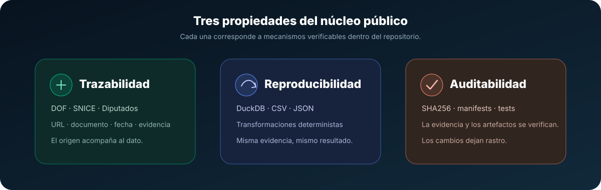
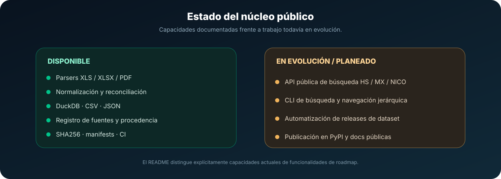

<div align="center">


# arancel-mx

### Datos arancelarios de México, reproducibles, auditables y trazables.

Herramientas abiertas en Python para capturar, normalizar, reconciliar y publicar datos arancelarios de México con procedencia verificable.

<p>
  <strong>Español</strong> · <a href="./README.en.md">English</a>
</p>

[](https://github.com/jccontrerasg08-cpu/arancel-mx/actions)
[](https://www.python.org)
[](LICENSE)
[](https://duckdb.org/)
[](CONTRIBUTING.md)

**[Inicio rápido](#instalación)** · **[CLI](#uso-rápido-cli)** · **[Python](#uso-desde-python)** · **[Datos](#modelo-de-datos)** · **[Fuentes](#fuentes-oficiales)** · **[Arquitectura](#arquitectura)** · **[Contribuir](#contribución)**

</div>

---

<!-- demo -->
<p align="center">
  
</p>

<p align="center"><strong>Captura · Normaliza · Reconcilia · Valida · Publica</strong></p>

---

## Alcance

`arancel-mx` es un proyecto público enfocado en construir una capa de datos abierta, reproducible y auditable para trabajar con información arancelaria de México, con trazabilidad hacia fuentes oficiales.

El núcleo público está orientado a datos y herramientas reutilizables: LIGIE, NICO, normalización de códigos HS, tarifas, procedencia documental, DuckDB y artefactos reproducibles. No pretende reemplazar sistemas comerciales completos de comercio exterior.

> [!IMPORTANT]
> `arancel-mx` es una herramienta técnica y de datos. **No constituye asesoría legal.** Para decisiones de clasificación arancelaria, cumplimiento regulatorio, importación o exportación deben consultarse las fuentes oficiales aplicables y, cuando corresponda, profesionales especializados.

## Resumen rápido

- Audita y materializa la LIGIE / NICO en una base DuckDB reproducible
- Normaliza códigos HS y tasas, conserva procedencia legal y evidencia
- Exporta artefactos deterministas: CSV, JSON, DuckDB y manifiesto con SHA256

| Capacidad | Qué aporta |
|---|---|
| Captura | Evidencia proveniente de publicaciones oficiales |
| Normalización | Códigos y tarifas en representaciones canónicas |
| Trazabilidad | Procedencia documental y origen por registro |
| Reconciliación | Comparación entre evidencias oficiales |
| Persistencia | Base analítica reproducible en DuckDB |
| Publicación | CSV, JSON, DuckDB y manifiestos con SHA256 |

## Por qué es diferente

- Procedencia: cada fila conserva la evidencia documental y el origen (DOF / SNICE / Diputados)
- Determinismo: exportaciones reproducibles con manifiestos y sumas de verificación
- Auditable: flujos de descubrimiento, captura, reconciliación y validación

<p align="center">
  
</p>

## De HS a fracción MX y NICO

Una de las direcciones del núcleo público es mantener una representación coherente de los distintos niveles de clasificación utilizados para mercancías, sin perder la evidencia que respalda cada relación.

<p align="center">
  
</p>

Conceptualmente:

```text
HS 6 dígitos
      ↓
Fracción arancelaria mexicana 8 dígitos
      ↓
NICO 2 dígitos adicionales
      ↓
Identificador mexicano de 10 dígitos
```

Las funciones públicas de búsqueda y navegación HS6 ↔ MX8 ↔ NICO10 todavía se consideran parte del roadmap hasta que estén implementadas, documentadas y probadas como API estable.

## Características principales

- Parsers offline de XLS/XLSX/PDF para LIGIE y NICO
- Normalización canónica de códigos y tarifas
- Consolidación y versionado determinista de registros
- Flujos para capturar fuentes, verificar DOF y construir releases verificables

Además, el repositorio ya organiza su núcleo alrededor de parsers, pipeline, fuentes, almacenamiento y construcción de releases, con pruebas automatizadas para reproducibilidad y distribución pública.

## Arquitectura

El pipeline separa descubrimiento, captura, procesamiento, validación y publicación para que cada etapa pueda auditarse de forma independiente.

<p align="center">
  
</p>

```text
DOF / SNICE / Diputados
          ↓
      discovery
          ↓
       capture
    URL + evidencia + SHA256
          ↓
        parser
   XLS / XLSX / PDF
          ↓
    normalización
          ↓
      validación
          ↓
   reconciliación
          ↓
       DuckDB
    ↙      ↓      ↘
  CSV     JSON   manifest
          ↓
        release
```

## Instalación

```bash
python -m venv .venv
# PowerShell: .\.venv\Scripts\Activate.ps1
# macOS/Linux: source .venv/bin/activate
python -m pip install -e ".[dev]"
```

Requiere Python 3.11 o superior. Después de activar el entorno, puedes comprobar el CLI con:

```bash
python -m arancel_mx --help
```

## Uso rápido (CLI)

Los comandos públicos actuales son `build`, `update`, `reconcile` y `release`.

```bash
# ver ayuda
python -m arancel_mx --help

# exportar artefactos desde una base DuckDB ya validada
python -m arancel_mx build --database data/arancel.duckdb --output-dir out/release

# actualizar estado desde el ledger oficial (requiere red)
python -m arancel_mx update --state-path data/update_state/ligie.json --report-path out/update.json

# reconciliar evidencia
python -m arancel_mx reconcile --ledger-json ledger.json --dof-json dof.json --snice-json snice.json

# preparar artefactos locales para publicación
python -m arancel_mx release --release-dir out/release --source-dir data/raw/release --latest-dir out/latest
```

### Qué hace cada comando

| Comando | Uso |
|---|---|
| `build` | Exporta una base arancelaria validada |
| `update` | Comprueba el ledger oficial de la LIGIE; puede requerir red |
| `reconcile` | Reconcilia evidencia legal arancelaria |
| `release` | Verifica y prepara artefactos de publicación |

## Uso desde Python

El paquete también puede importarse desde Python:

```python
import arancel_mx

print(arancel_mx.__version__)
```

La API pública de consulta irá creciendo conforme se estabilicen las interfaces de búsqueda, clasificación y relaciones HS / fracción / NICO. Las funciones que aún están en roadmap no se documentan aquí como API implementada.

## Modelo de datos

La base DuckDB funciona como representación analítica reproducible del dataset. El modelo busca separar clasificación, descripción y procedencia para poder reconstruir el origen de los datos.

```text
clasificación
├── HS
├── fracción MX
└── NICO

descripción
├── texto
├── unidad
└── tasa

procedencia
├── autoridad
├── documento
├── URL
├── fecha
└── hash
```

Consulta [`docs/data-model.md`](docs/data-model.md) para el modelo documentado del proyecto.

## Artefactos y reproducibilidad

La construcción oficial produce este contrato exacto:

```text
release/
├── arancel_mx.duckdb
├── arancel_mx.csv
├── arancel_mx.json
├── manifest.json
├── SHA256SUMS
└── official-sources.tar.gz
```

`manifest.json` registra versión, validación, fuentes y SHA256 de los artefactos. `SHA256SUMS` permite verificar los archivos descargados y `official-sources.tar.gz` conserva la evidencia oficial capturada utilizada por la construcción. La representación lógica se mantiene reproducible; el archivo físico DuckDB se verifica por su propio SHA256 en cada build.

### Construcción end-to-end de dataset oficial

El orquestador público puede construir el dataset directamente desde las fuentes registradas:

```bash
python scripts/build_official_dataset.py \
  --work-dir data/embedded/official-build \
  --output-dir out/release \
  --effective-as-of 2026-08-10 \
  --dataset-version 2026.08.10
```

El workflow **Build official dataset**, definido en [`.github/workflows/build-official-dataset.yml`](.github/workflows/build-official-dataset.yml), ejecuta primero la suite offline y después puede consultar las fuentes oficiales para producir y verificar un artifact de GitHub Actions. Se ejecuta manualmente mediante `workflow_dispatch` o por calendario semanal.

El workflow **no crea tags ni GitHub Releases**. La publicación de un tag y la promoción de los artefactos a GitHub Releases siguen siendo decisiones manuales y supervisadas. Consulta [`docs/release-process.md`](docs/release-process.md) para el proceso completo.

## Documentación y ejemplos

- docs/: modelo de datos, proceso de publicación y guías de fuentes
- tests/: fixtures y casos de prueba que aseguran reproducibilidad

Documentación principal:

| Documento | Contenido |
|---|---|
| [`docs/data-model.md`](docs/data-model.md) | Modelo de datos |
| [`docs/sources.md`](docs/sources.md) | Fuentes, procedencia y registro |
| [`docs/release-process.md`](docs/release-process.md) | Proceso de publicación |
| [`CONTRIBUTING.md`](CONTRIBUTING.md) | Guía para contribuir |
| [`SECURITY.md`](SECURITY.md) | Reporte responsable de vulnerabilidades |
| [`CODE_OF_CONDUCT.md`](CODE_OF_CONDUCT.md) | Código de conducta |

## Fuentes oficiales y URLs registradas

### Fuentes oficiales

El registro versionado de fuentes está en `src/arancel_mx/sources/source_registry.json`. Fuentes principales:

- Diputados - LIGIE (registro y texto vigente): https://www.diputados.gob.mx/LeyesBiblio/ref/ligie_2022.htm
- SNICE - índice LIGIE / publicaciones oficiales: https://www.snice.gob.mx/cs/avi/snice/ligie.info22.html
- SNICE - NICO / identificaciones comerciales: https://www.snice.gob.mx/cs/avi/snice/ligie.nico2022.html
- SNICE - Propuestas NICO (envíos y solicitudes): https://www.snice.gob.mx/cs/avi/snice/ligie.nico2022.html
- SNICE - Notas nacionales: https://www.snice.gob.mx/cs/avi/snice/ligie.notasnac22.html
- SNICE - Indicadores ponderados: https://www.snice.gob.mx/cs/avi/snice/ligie.indicaranc22.html
- Diario Oficial de la Federación (DOF) - nota relacionada (publicación NICO 2022): https://www.dof.gob.mx/nota_detalle.php?codigo=5656249&fecha=27/06/2022

| Fuente | Uso principal dentro del contexto del proyecto |
|---|---|
| Cámara de Diputados | Referencia y texto de la LIGIE |
| SNICE | LIGIE, NICO, notas nacionales, indicadores y publicaciones relacionadas |
| Diario Oficial de la Federación | Publicaciones y modificaciones oficiales |

El archivo [`src/arancel_mx/sources/source_registry.json`](src/arancel_mx/sources/source_registry.json) es la referencia técnica versionada para patrones de fichero, URLs y reglas de clasificación. También puedes consultar [`docs/sources.md`](docs/sources.md).

## Proceso y calendario (visual)

Las autoridades publican cronogramas y procedimientos asociados a la recepción, evaluación y publicación de solicitudes (NICO / reformas). A continuación se incluyen ilustraciones oficializadas que muestran el calendario de recepción/publicación y el flujo de envío y publicación de NICO/DOF.

### Calendario y proceso, parte 1

<p align="center">
  
</p>

### Calendario y proceso, parte 2

<p align="center">
  
</p>

<p align="center">
  <em>Fuente: Diario Oficial de la Federación / SNICE - ver la nota oficial en DOF para detalles y fechas exactas.</em>
</p>

### Flujo de publicación NICO / DOF

<p align="center">
  
</p>

Ver también `src/arancel_mx/sources/source_registry.json` para patrones de fichero y reglas de clasificación.

Estas imágenes sirven como contexto documental del proceso oficial. No deben interpretarse como un indicador dinámico del estado técnico del dataset.

## Estado del proyecto

<p align="center">
  
</p>

| Componente | Estado documentado |
|---|---|
| Parsers XLS / XLSX / PDF | Disponible |
| Normalización | Disponible |
| DuckDB | Disponible |
| CSV / JSON | Disponible |
| Reconciliación | Disponible |
| Registro de fuentes | Disponible |
| Manifiestos SHA256 | Disponible |
| CLI `build`, `update`, `reconcile`, `release` | Disponible |
| Construcción end-to-end de dataset oficial | Disponible |
| Artifact verificado de GitHub Actions | Disponible |
| CI | Disponible |
| API pública de búsqueda HS / MX / NICO | En evolución / roadmap |
| Publicación PyPI | Planeada |

## Roadmap

Dirección prevista del núcleo público:

- búsqueda por descripción
- consulta por código
- navegación HS6 → fracción MX8 → NICO10
- navegación NICO10 → fracción MX8 → HS6
- CLI de búsqueda
- detección automatizada de cambios oficiales
- publicación automática supervisada a GitHub Releases
- publicación del paquete en PyPI
- documentación pública navegable
- interfaces adicionales de consulta, incluida la posibilidad futura de API o MCP

Las funcionalidades del roadmap no deben considerarse parte de la API estable hasta que estén implementadas, documentadas y probadas.

## Estructura del repositorio

```text
arancel-mx/
├── .github/
│   └── workflows/
│       ├── ci.yml
│       └── build-official-dataset.yml
├── docs/
│   ├── data-model.md
│   ├── sources.md
│   ├── release-process.md
│   ├── demo.gif
│   ├── dof_timeline.png
│   ├── dof_timeline2.png
│   └── nico_flow.png
├── scripts/
│   └── build_official_dataset.py
├── src/
│   └── arancel_mx/
│       ├── domain/
│       ├── parsers/
│       ├── pipeline/
│       ├── release/
│       ├── sources/
│       └── storage/
├── tests/
├── CONTRIBUTING.md
├── SECURITY.md
├── CODE_OF_CONDUCT.md
├── LICENSE
├── NOTICE
├── pyproject.toml
├── README.en.md
└── README.md
```

- `domain/`: modelos y reglas del dominio arancelario.
- `parsers/`: lectura y extracción de XLS, XLSX y PDF.
- `pipeline/`: normalización, reconciliación y flujos de actualización.
- `sources/`: registro y lógica asociada a fuentes oficiales.
- `storage/`: persistencia y estructuras asociadas a DuckDB.
- `release/`: construcción y validación de artefactos publicables.
- `scripts/`: entradas reproducibles para construir datasets verificables.
- `tests/`: fixtures y casos de prueba que aseguran reproducibilidad y el contrato de distribución pública.

## Pruebas

Ejecuta las pruebas antes de proponer PRs

```bash
python -m pytest -q
python -m build
```

Para reproducir las comprobaciones principales de CI localmente:

```bash
python -m pytest -q
python -m build
git diff --check
```

CI utiliza el mismo conjunto de dependencias de desarrollo instalado mediante:

```bash
python -m pip install -e ".[dev]"
```

## Buenas prácticas para contribuciones

1. Abrir un issue describiendo el cambio o el bug
2. Crear una rama con nombre descriptivo (ej.: `feat/add-source-dof`)
3. Añadir tests y fixtures offline cuando el cambio afecta parsers o transformaciones
4. Mantener trazabilidad de las fuentes (capture manifests y hashes)

Además, evita introducir datos o evidencia cuya procedencia no pueda identificarse y mantén los cambios del núcleo público enfocados en datos arancelarios mexicanos.

## Contribución / contacto

- Lee CONTRIBUTING.md y SECURITY.md antes de enviar PRs
- Usa issues para discutir cambios grandes o nuevos orígenes

## Contribución

Las contribuciones son bienvenidas. Antes de abrir un Pull Request, revisa [`CONTRIBUTING.md`](CONTRIBUTING.md), [`SECURITY.md`](SECURITY.md) y [`CODE_OF_CONDUCT.md`](CODE_OF_CONDUCT.md).

Para cambios significativos, abre un issue primero y utiliza una rama descriptiva como:

```text
feat/add-source-dof
```

## Seguridad

Consulta [`SECURITY.md`](SECURITY.md) para el proceso de reporte responsable de vulnerabilidades.

No publiques tokens, API keys, cookies de sesión, credenciales, secretos, archivos `.env` ni claves privadas en commits, fixtures, issues o Pull Requests.

## Licencia

Este proyecto se distribuye bajo la licencia Apache-2.0. Consulta LICENSE y NOTICE para atribuciones.

- [`LICENSE`](LICENSE)
- [`NOTICE`](NOTICE)

Los documentos y datos obtenidos desde organismos oficiales pueden estar sujetos a sus propias disposiciones y condiciones aplicables.

## Agradecimientos

Gracias a los equipos que publican y mantienen las fuentes oficiales (Diputados, SNICE, DOF) y a la comunidad de código abierto por sus plantillas y prácticas de documentación.

Gracias también a las instituciones responsables de mantener disponible la información pública que hace posible construir herramientas reproducibles y auditables alrededor del comercio exterior mexicano.

---

<div align="center">

### arancel-mx

**Datos abiertos · procedencia verificable · releases reproducibles**

[Documentación](docs/) · [Fuentes](docs/sources.md) · [Contribuir](CONTRIBUTING.md) · [Seguridad](SECURITY.md) · [English](README.en.md)

</div>